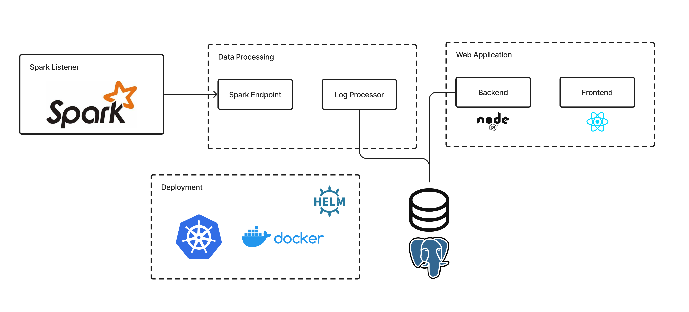

Lucia enables data engineers to monitor, analyze and manage their data pipelines on Spark with visibility into performance over time. Lucia is free and open-source.

# Lucia - Data Pipeline Observability Tool
Lucia is a Data Pipeline Observability tool that helps you monitor, analyze, and manage your data pipelines. It provides a comprehensive view into the health of your data pipeline, allowing you to identify and address performance and cost issues quickly.
The Lucia project is developed and maintained by [Montara]([url](http://montara.io)).

# Overview
Lucia provides data engineers with full visibility into their Spark data pipelines. With Lucia you can understand the cost and performance structure of each job in your pipeline as well as compare runs and jobs to understand trends over time, variations between customers/tenants, runs, model versions and more.

# Getting Started
To spin up an entire Kubernetes cluster with Lucia using [Helm](helm.sh/) simply run:<br />
`helm install montara`

To start collecting metric from Spark executions, you will also need to install our Spark Listener. For more information [please see the documentation](https://github.com/montara-io/lucia-spark-listener#readme).
For Lucia’s Spark Listener you need to provide the following parameters:
Colons can be used to align columns.

|Parameter |Explanation |Required? |
|-------------|-------------|-----|
|jobId |Unique identifier of the job. Your job ID should be constant across runs to enable analysis over time. |Yes |
|pipelineId |Unique identifier of the data pipeline. Allows you to visualize your jobs as part of a specific pipeline. |Optional |
|jobRunId | |Yes |
|piplineRunId |  |Optional |

# Architecture


# Metrics
|Metric |Explanation |
|-----------|------------------|
|Total cores number |Number of cores available in all the executors. |
|Number of executors |Total number of executors.|
|Total bytes read |Total number of bytes while reading data from HadoopRDD or from persisted data.|
|Total bytes written |Total number of bytes associated with external data writing (e.g. to a distributed filesystem), defined only in tasks with output.|
|Total shuffle bytes read |Total number of bytes read in shuffle operations (both local and remote), summed from all the executors. |
|Total shuffle bytes write |Total number of bytes written in shuffle operations, summed from all the executors. |
|Total CPU uptime |The sum of the lifetime duration of each executor multiplied by the number of CPU per executor (number of cores). The value is expressed in seconds. |
|Total CPU time used | Sum of all the executors CPU time. CPU time of executor is the time it spent running all the tasks. This includes time fetching shuffle data. The value is expressed in seconds. |
|CPU utilization |Total CPU time used/Total CPU uptime. |
|Peak memory usage |The maximum memory usage observed from all the executors, (including Java Virtual Machine memory usage and Python processes memory usage). The total available memory is inferred from the Spark configurations. For each executor: total memory used in the executor/total available memory of the executor. Than the maximum is shown.|
|Start time |The start time of the job. |
|End time | The end time of the job.|

# FAQ
Let us know if missed anything by contacting us - support@montara.io 

### Is Lucia free?
Yes, Lucia absolutely free of charge.

### Are there any non open-source components in Lucia?
No, the entire project is open source.

### What exactly do you collect?
Our Spark Listener looks at Spark event logs (See documentation in Apache Spark). This means Lucia doesn’t  access your data nor your Spark code. These logs are processed and translated into metrics.

### How long does it take to see metrics of a job that finished running?
Processing happens in real-time, so as soon as a job ends.

### How do I sign in to the Lucia Web Application
There is no login process as the application resides on your private cloud.

### How is Lucia different from Delight?
Both [Delight](http://github.com/datamechanics/delight) and Lucia display job metrics. The main difference is that Delight doesn't compare metrics across runs. A true analysis and anomaly identification is only achievable when comparing different runs of the same job or pipeline. Also, Delight doesn’t have a pipeline notion in mind. Sometimes, data engineers want the big picture of the entire pipeline before drilling into specific jobs. 

# Developing locally
#### Docker-compose or helm-char for running the entire Lucia project in your premise

## docker compose

docker compose will setup the lucia environment running the following services:

- db - a postgres db
- flyway - migration scripts setting up the db schema
- kafka - messaging service used to communicate between services
- lucia-web-backend - the web backend service supporting the apis needed by the UI
- lucia-web-ui - the web UI
- lucia-spark-endpoint - endpoint exposed for the spark connector
- lucia spark-job-processor - backend service that processes the spark events

### env setup

In order to run the Lucia environment in docker compose run the following command

    ```
    cd docker-compose
    docker-compose pull
    docker-compose -p lucia up -d
    ```

This will run it under the lucia project name

### local env setup debugging

In order to build and then run the Lucia local environment in docker compose and debug with attach docker,
run the following command

1. clone and build the repositories with the following command
   NOTE: this will clone, then build the lucia projects locally, for this you need to have ssh configured on github:

   ```
   sh build
   ```

2. run docker-compose with the following command:
   ```
   cd docker-compose
   docker-compose -p lucia-local -f docker-compose-local.yml  up -d --build
   ```

This will run it under the lucia-local project name

## helm chart
The followint command will deploy the Lucia helm chart
Note: You should have Helm preinstall and configured and kubernetes to point to the right location

```
 cd lucia-helm-chart
 helm install <chart-name> .
```
If you want to use a specific namespace use (for example 'lucia')

```
   helm install <chart-name> . --create-namespace --namespace lucia
```

In order to update to the latest helm do git pull and then

```
   helm upgrade <chart-name> . 
```

## Lucia projects

1. [Web (backend + frontent)](https://github.com/montara-io/lucia-web)

2. [Data (Endpoint + Processor)](https://github.com/montara-io/lucia-data)

3. [Listener](https://github.com/montara-io/lucia-spark-listener)
